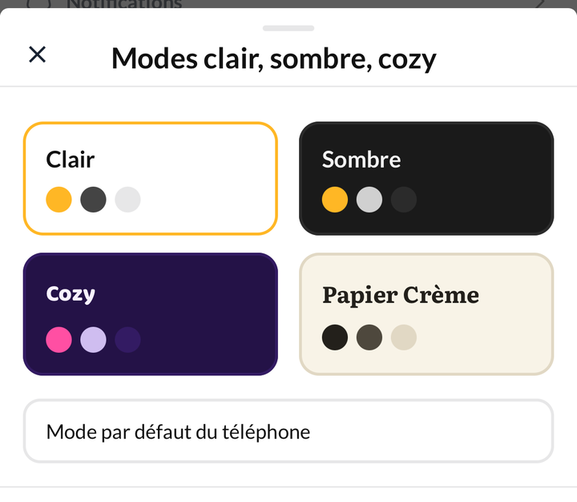
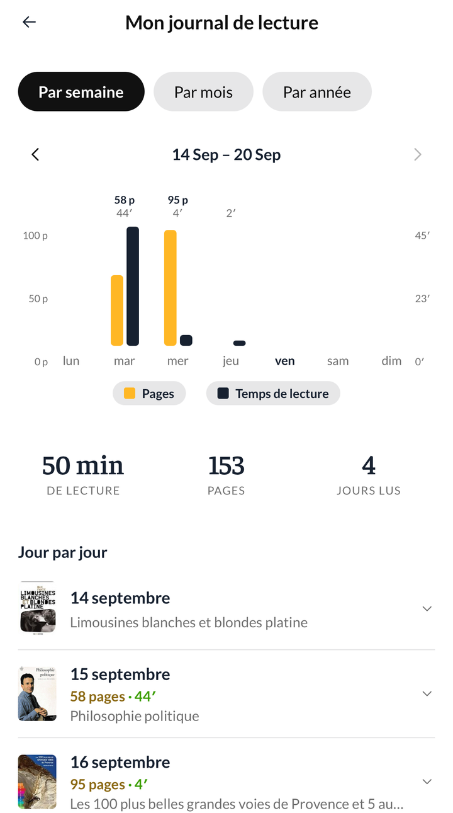

## Nouveautés

### Quatre thèmes au choix

Clair, sombre, Cozy et Papier Crème. Le mode se change dans
**Réglages › Modes clair, sombre, cozy**, et l'application entière suit —
y compris les couvertures et les graphiques.

### Votre journal réunit le calendrier et les statistiques

**Profil › Mon journal** rassemble ce qui vivait à deux endroits. Trois
échelles : par semaine pour voir vos pages et vos minutes jour après jour,
par mois pour retrouver les livres refermés, par année pour la vue
d'ensemble.

Sous le graphique de la semaine, chaque journée s'ouvre sur le détail de
ses sessions.

### Le tirage au sort, sur toutes vos étagères

Le dé ne fonctionnait que sur « À lire » et la wishlist. Il fonctionne
maintenant sur n'importe quelle étagère, y compris celles que vous créez.

## Corrections

- **Les dates de lecture s'inscrivent de nouveau seules.** Passer un livre
  à « Lu » ou « En cours » pose la date correspondante, quel que soit
  l'endroit d'où vous le faites : la fiche du livre, le scanner, le
  chronomètre, une sélection multiple. Le réglage se trouve dans
  **Réglages › Date et statut de lecture automatique**.
- **Une session mal saisie se supprime.** La croix était présente mais
  presque invisible ; elle se voit désormais dans l'historique du livre et
  dans le journal.
- **La série de lecture s'ouvre au toucher** sur toute la carte, même
  lorsqu'aucune série n'est en cours.
- L'écran des statistiques d'une année s'affiche en une seconde et demie
  au lieu de huit.
